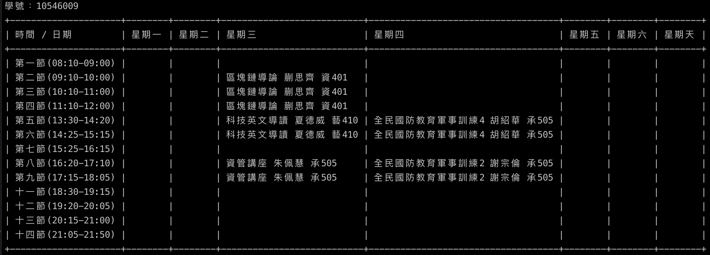

# ntub_student_courses

> 北商該學期課表查詢

> For macOS

## Do before run
- env：`$ python3 -m venv env`
- run env：`$ . env/bin/activate`
- install packing：`$ pip3 install -r requirements.txt`

## Run
- run：`$ python3 main.py`

